#+title: 2026 in 52 albums
#+HTML_HEAD: <link rel="stylesheet" type="text/css" href="style.css" />
#+OPTIONS: html-style:nil H:1 num:nil toc:nil
The concept's pretty simple.  One album per week, not necessarily [[https://nmmull.github.io][my]]
favorite album of the week, not necessarily a new album, just one I
listened to and liked.

-----

* Week 12 (3/15)

#+ATTR_HTML: :width 300px
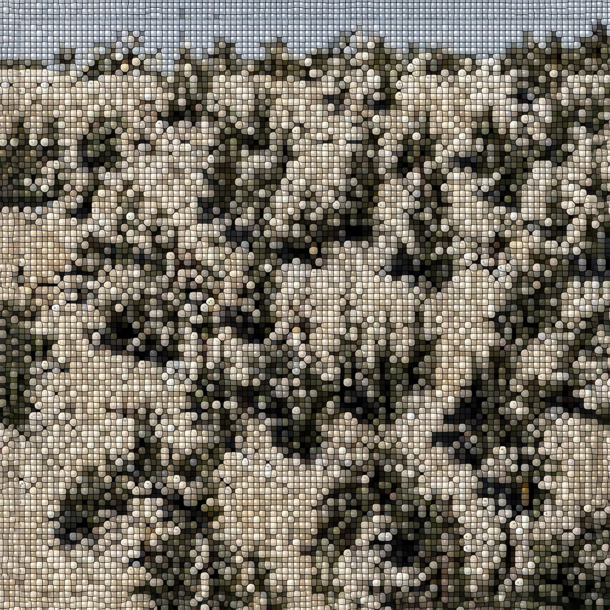

[[https://intlanthem.bandcamp.com/album/extra-stars][*Extra Stars* by Gregory Uhlmann]]

Gregory Uhlmann at it again, in a strange but not unprecedented way.
Something like an academic study of blips, bloops, taps, tinkles,
thumps, and drones.  What more could you want (or say, for that matter)?

-----

* Week 11 (3/8)

#+ATTR_HTML: :width 300px
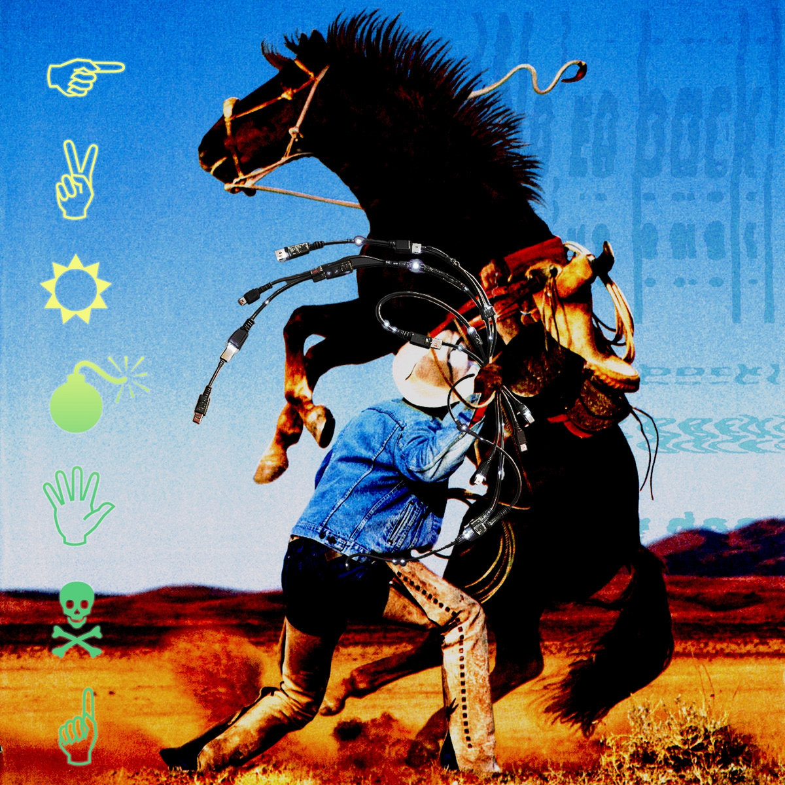

[[https://deathbombarc.bandcamp.com/album/farming][*Farming* by Ted Hearne & The Crossing]]

At the risk of offending a group of folks I do not wish to offend (and
with the hope of offending a different group just the right amount) I
submit the following claim: nunchucks are the dorkiest martial arts
weapon (I'm choosing to use the Americanism "nunchucks" instead of the
more correct "nunchaku" because I've never in my life actually heard
the word "nunchaku" said aloud).  This isn't inherent in the form or
origin of the implement, rather the product of a near-concerted effort
by a species of dorky white male American sinophile.  In order to lend
myself an iota of authority on the matter (of which, in reality, I
have none) I'll mention briefly that I practiced Kung Fu as a "yute",
and although I was partial to the humble broadsword (which I have to
thank for a souvenir in the form of a 1in scar on my ankle,
self-inflicted (accidently) by one such sword of the blunt practice
variety) I was also fascinated in that same (teenage)-dorky-sinophile
way to the more "exotic" weapons, e.g., the double hook swords of
Jet-from-Avatar fame, the double hammers (which also make an
appearance in ALTA with a lesser bad-guy side character), the chain
whip (whatever you're imagining is probably pretty close), and a
personal favorite, worthy of a Google: the horse bench.  And although
I've already spent too much time on this supposedly brief aside, I
can't help but recall a memory watching the performance of a dual
weapon form (think choreographed knife fight) between chain-whip and
double hook sword, which felt like the moral equivalent of throwing
firecrackers at someone with a weed-whacker.

Self-consciously (bad) Wallacian digression aside, I further submit a
thought experiment: imagine watching a performance of said dorky white
male American sinophile /using/ said nunchucks.  Furthermore, this is
someone who has taken up the practice of martial arts not simply as a
kind of socially-recognized affectation, but who has /actually/
studied the art /as an art/ and is /actually/ pretty good.  Imagine
him manipulating those chained wooden sticks with Bruce-Lee-level
grace, but still moving in that somewhat awkwardly stiff way that
people who haven't done gymnastics/dance/acrobatics their whole lives
naturally do.  If the image in your mind is at all similar to mine,
you might get the sense of the cringy beauty I'm trying to convey (in
my now-very-self-consciously circuitous way).

The thesis: /Ted Hearne & The Crossing wield irony like our friend
from the though-experiment wields nunchucks./ I can't say that
*Farming* is a "good" album, but it has that aforementioned cringy
beauty; I can't stop listening even though it makes me tired and a
little angry.  Sound-wise, it brings to mind Roomful of Teeth's *Rough
Magic*, in which the group seemed to want more "edge", except that
*Farming* takes this concept to it's Weierstrassian extreme, to a
veritable lump of nothing-but-edge (where, if you tried to pick it up,
you'd be infinitely pin-pricked by its fractalous surface).  I imagine
an AI agent fed on a steady diet of Reich's speech-melodies,
Americana, Fox News, and church-on-TV could hallucinate a solid
approximation of this album, but there's something so /human/ and so
utterly /committed/ in the combination of heavy-handed social
commentary and high production value and the literal human-factor that
The Crossing brings.  There's a feeling of fighting fire with
howitzers, a recognition of futility alongside a real sense that they
are trying to say /something/.  And sometimes they seemingly do, other
times they emphatically do not.  Regardless, it leaves the mind
reeling, /is this what it takes to get me out of my
individualist-consumerist stupor and actually do something?/ Probably
not, but I did ask myself the question.

* Week 10 (3/1)

#+ATTR_HTML: :width 300px
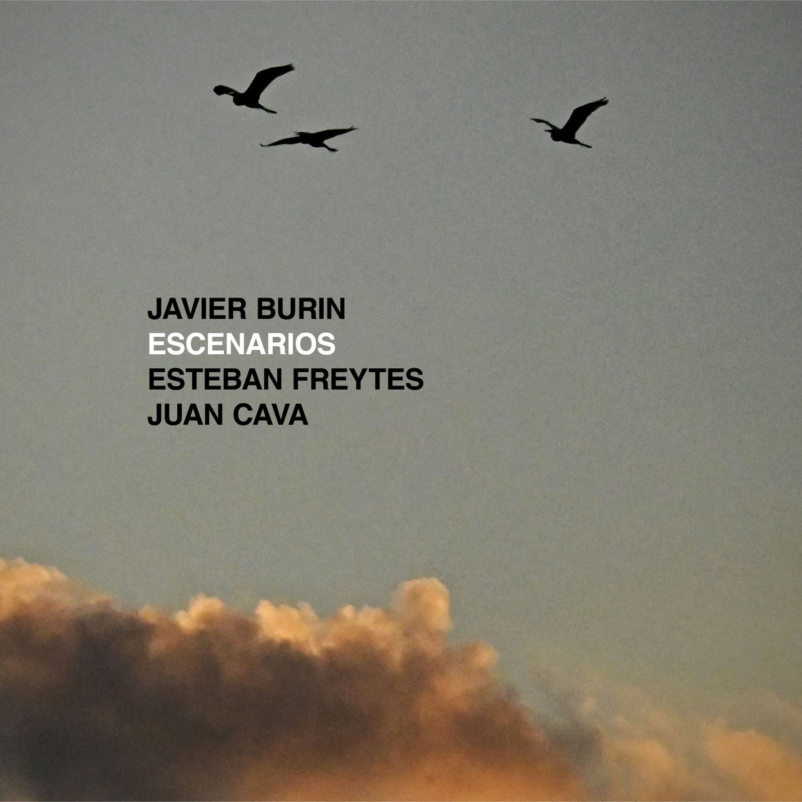

[[https://javierburin.bandcamp.com/album/escenarios][*Escenarios* by Javier Burin]]

I've been on the fence about this one for a while now.  I thought I'd
make it this week's album so I could figure out if I actually like
it. Final analysis: I do.  This one made me work for it; at first it
just barely registered under the din of the currently-crowded
post-bebop/modern chamber jazz soundscape.  I think what ultimately
did it for me was the solo in the second track "PF" which plays like a
slightly unhinged Bach.  It also took me several listens to realize
just how full-bodied the tracks are.  The first couple listen-throughs
I guess I thought some tracks were multiple; several of them are past
the 7m mark and often the thread, though strong, weaves haphazardously
through a number of different stylistic groundings (no apologies for
mixing metaphors).  One gets the feeling when listening to these folks
(if my experience is not wholly solipsistic) of being in the presence
of some wicked talent (I'm a Bostonian now), talent that is achingly
vying for attention.  This doesn't mean it's contentious──sometimes
the easiest way to get someone's attention is with the help of some
other attention-getters──but it lacks that cool
I'm-so-good-I-could-give-my-buddy-the-spotlight-and-you-still-couldn't-help-noticing-me
character of some of my absolute favorite jazz albums (people who've
known me long enough and have talked music with me will know that my
such-as example is Ben Wendel's *Understory: Live at the Village
Vanguard*).  One consequence: the album is sprinkled with "gimmicks"
several of which are used by the greats but are gimmicks none the
less: (1) the bass-follow-piano riffs that give a satisfying almost
hip-hop cadence (2) the hidden-rhythm syncopation of one voice
followed by the another which sets the beat (like Vijay Iyer's
"Accelerando" or Dirty Projectors' "The Socialites").  But in my view
the real kicker is that Javier Burin is freakin' 25 (22 on recording
this album), and I'm very much looking forward to whatever's next.

-----

* Week 9 (2/22)

#+ATTR_HTML: :width 300px
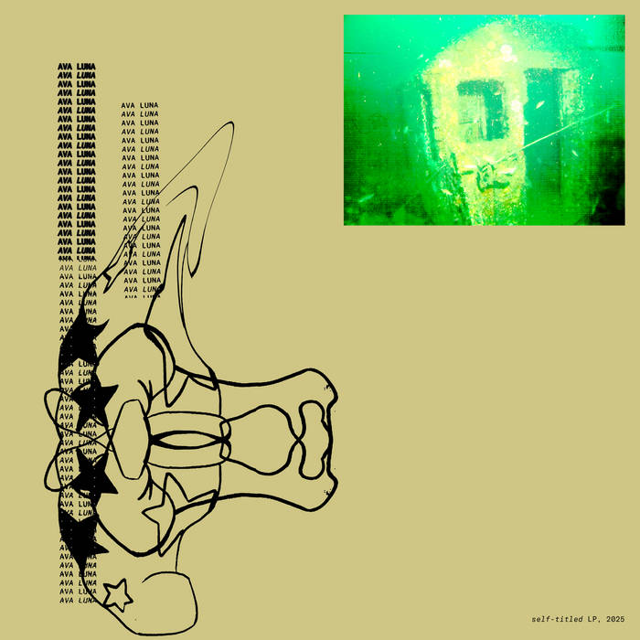

[[https://avaluna.bandcamp.com/album/ava-luna][*Ava Luna* by Ava Luna]]

Ava Luna is era-defining for me (which essentially means I listened to
them in college).  *Electric Balloon* felt like a revelation (though I
would later learn it was basically a revival of no-wave in the style
of James Chance and the Contortions).  I remember being floored by
"Billz", the first single off *Infinite House*, with its oscillations
between crushing wall of noise and chill groove; urgent and virtuosic,
driven by the truly important questions: "who's gonna pay my bills?"
(also, gotta say, "Steve Polyester" is one of the best non-Pynchon
Pynchon characters out there).  I was lukewarm on *Moon 2*, I enjoyed
it primarily in a second-order way, but it felt like it wasn't meant
for me (maybe for someone with stronger ties to Devo and Talking
Heads). I was bummed to hear in 2019 that we weren't gonna get any
more Ava Luna, but Carlos Hernandez and Felicia Douglass continued to
make music so it didn't feel /over/ over (*On Folly* seemed very much
a continuation of the Ava Luna storyline).  Last week, getting a
sudden urge to listen back to *Moon 2* (maybe this time I'd "get it")
I learned that Ava Luna came out with an album last year (!). On first
listen I was, disappointed.  It has none of the pent-up energy, the
deep-cutting angst, less I-need-to-say-this-let-me-speak and more
getting-older-and-throwing-up-the-hands.  The album is a distillation
of everything that makes Ava Luna unequaled composers and musicians,
but I see parallels with the last Dirty Projectors project *Songs of
the Earth*, in which composition becomes the sole vehicle for
expression.  Despite this, I listened through again, and then again,
and again, and then it clicked: it's a damn fun album.  That I think
is the thread through everything they do.  They're a group of super
talented folks, getting together yet again to make music, building on
their years-worth of experiences, and the product is, simply put,
beautiful.  The banter at the end of "My Walk" makes me smile every
time I listen to it.

-----

* Week 8 (2/15)

#+ATTR_HTML: :width 300px
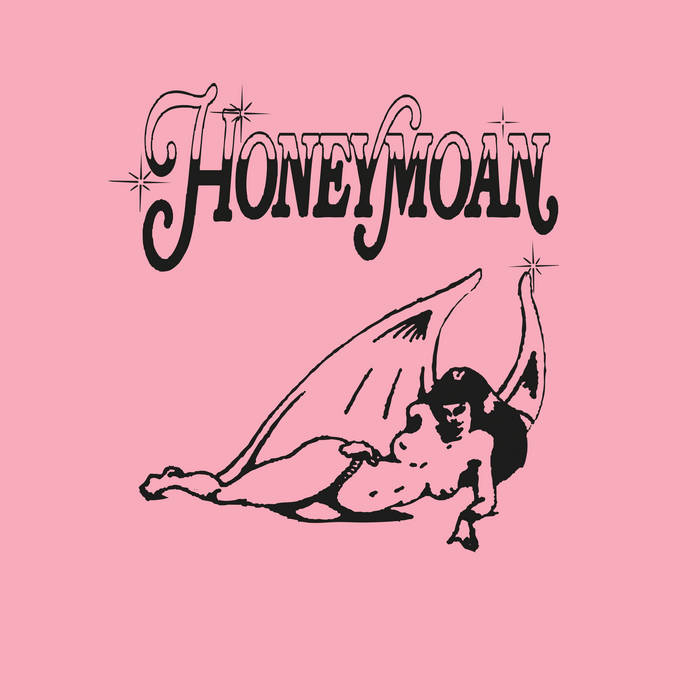

[[https://honeymoan.bandcamp.com/album/pink-hell-deluxe][*Pink Hell* by Honeymoan]]

Sometimes I feel like I'm getting too old for ironic
depresso-mean-girl synth-pop-punk bullshit (also thinking of Dev
Lemons here) but, yeah, catharsis to the max, cathart all the way home
to this turned up loud in my little impreza.

-----

* Week 7 (2/8)

#+ATTR_HTML: :width 300px

[[https://www.prestomusic.com/classical/products/8080670--britten-korngold-violin-concertos][*Britten & Korngold: Violin Concertos* by Vilde Frang, with the
Frankfurt Radio Symphony Orchestra, conducted by James Gaffigan]]

This week I watched the BU Symphony Orchestra's first concert of the
year, whose program included a performance by Juan Shin──the CFA 2025
concerto competition winner──of the Korngold Violin Concerto.  And,
though hyperbolic, maybe with a touch of romanticism that parrots the
piece itself, I'd say this felt like a once in a lifetime experience.
Juan's playing was technically exquisite, graceful and easy, yet
charged.  The performance felt like a gift, especially with the
intimacy of the setting: a small audience in a university auditorium
on a Friday night (and, jeez, what a stunning dress). It was the kind
of performances that makes me want to "pay it forward", to make sure I
too am giving in any way I can.  I chose this album simply as a token
(also the Britten is an all time favorite of mine).

-----

* Week 6 (2/1)

#+ATTR_HTML: :width 300px
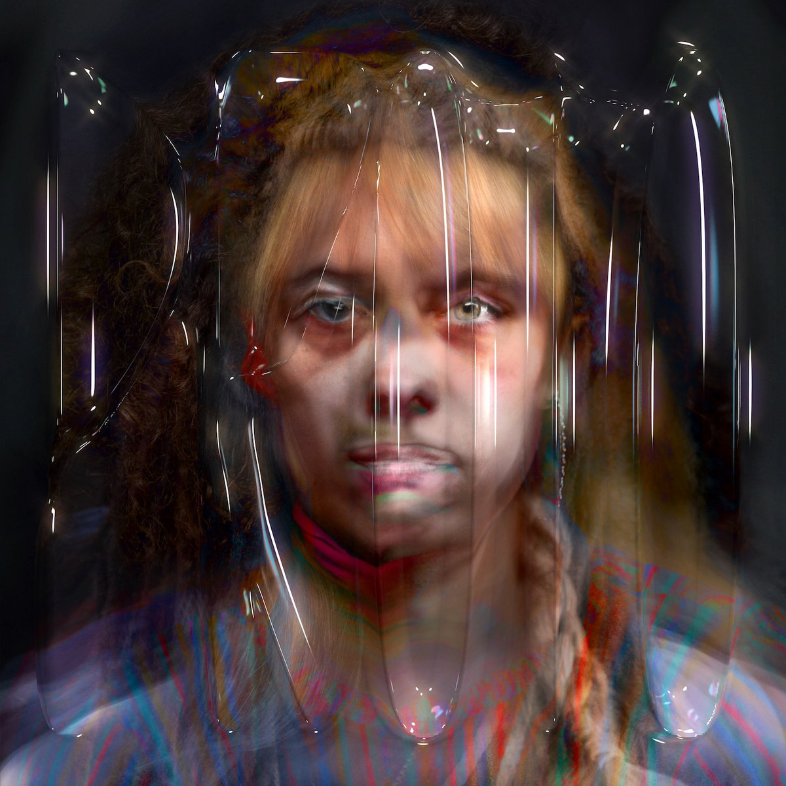

[[https://hollyherndon.bandcamp.com/album/proto][*PROTO* by Holly Herndon]]

With all that's going on in the AI-sphere, this 2019 AI-music
experiment feels almost quiant. It's a marked departure from Herndon's
previous albums; when listening to *Movement*, one has the feeling
that every synth began life as a sine wave and was molded to fit its
aural purpose, wrestled into submission and imbued with a sense of the
primordial.  In *PROTO*, Herndon takes the voice as the starting
point, and uses AI to aid the molding, a more powerful tool for a less
giving medium.  This is done to great effect, but I believe falls into
the trap of many early-AI projects: AI is used in the way that reverb
is used in recording, it creates "aura" but muddles personality
(compare Casals and Ma on the cello suites).  The AI of it all pushes
Herndon towards "the middle", welcoming more than usual (not
unflattering) comparisons──I get flavors of Oneohtrix Point Never,
Caroline Shaw, Julia Holter, Purity Ring, and it's hard not to think
of Imogen Heap, at least for folks listening to music in the aughts.
Taken as an experiment (as I think it's intended) *PROTO* is
ground-breaking, and I can't think of anyone I'd rather address the
AI-music problem.

-----

* Week 5 (1/25)

#+ATTR_HTML: :width 300px
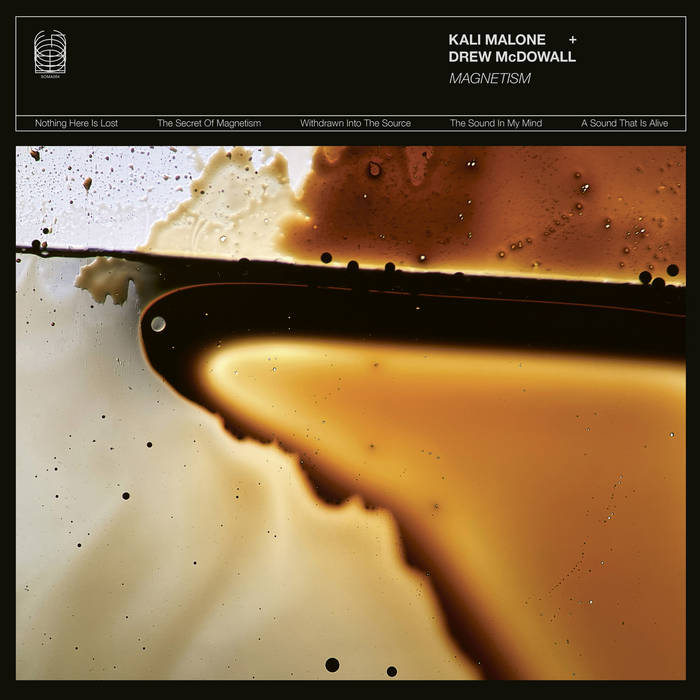

[[https://kalimalone.bandcamp.com/album/magnetism][*Magnetism* by the Kali Malone + Drew McDowall]]

Ambient can sometimes be inscrutable (at least for me) but
occasionally you get lucky with the context in which you first hear a
piece of ambient.  I was in a weird place in my life, staring out at a
pond on a cool fall day while my car was getting serviced.  The
emergent overtones and relentlessly compressed bass drones of the
synthesizer just worked for this scene and headspace.

-----

* Week 4 (1/18)

#+ATTR_HTML: :width 300px
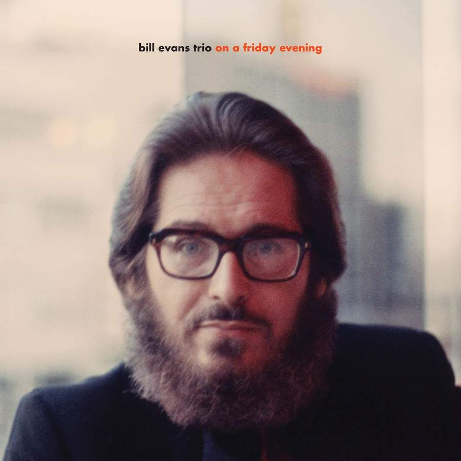

[[https://www.prestomusic.com/jazz/products/8907369--on-a-friday-evening][*On A Friday Evening* by the Bill Evans Trio]]

Every so often, I need to listen to Evans.  And after week one of
the spring semester, I needed something with quiet strength.  Evans
for me straddles the Burkian beauty-sublime divide, the decisions
he makes with regard to phrasing seem written in the clouds.  I
also kinda love Eddie Gomez's buzzy bass in this recording, it
brings out the lightness and occasional humor of it all.

-----

* Week 3 (1/11)

#+ATTR_HTML: :width 300px
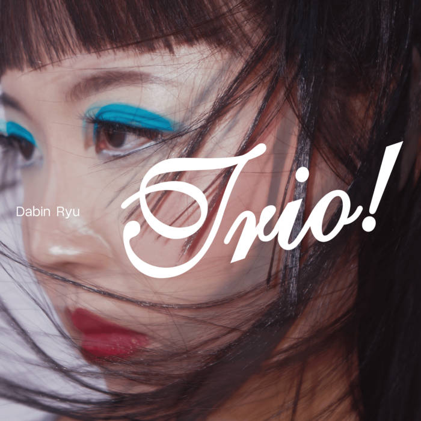

[[https://dabinryu.bandcamp.com/album/trio][*Trio!* by Dabin Ryu]]

Dabin Ryu has classical-pianist-energy.  The opener "Vertigo" has
Ólafsson precision (sub Bach for post-bop) and the intro of "In the
Land of Oo-Bla-Dee" plays like a Prokofiev piano sonata.  Also goes
without saying, Joe Martin (bass) and Johnathan Blake (drums) hold
their own, and have plenty of their own shining moments.

-----

* Week 2 (1/4)

#+ATTR_HTML: :width 300px
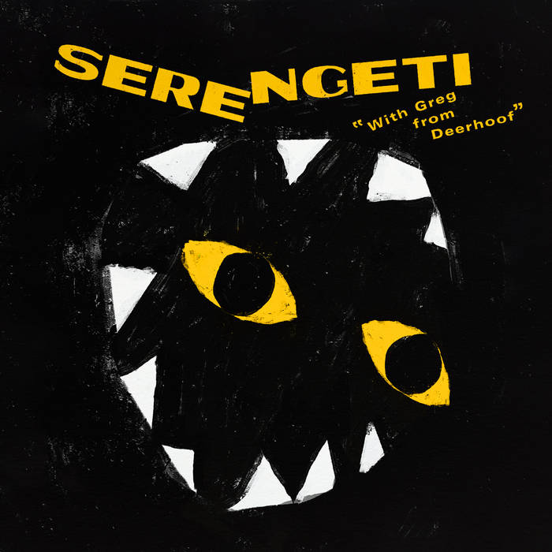

[[https://serengeti.bandcamp.com/album/with-greg-from-deerhoof][*With Greg from Deerhoof* by Serengeti]]

An unexpected but natural collaboration, the 17 minute ad-hoc live
session "I Got Your Password" is unreal.  This album has been on my
listening queue for years, but I think aptly captures 2026's
off-the-bat absurdities.

-----

* Week 1 (1/1)

#+ATTR_HTML: :width 300px
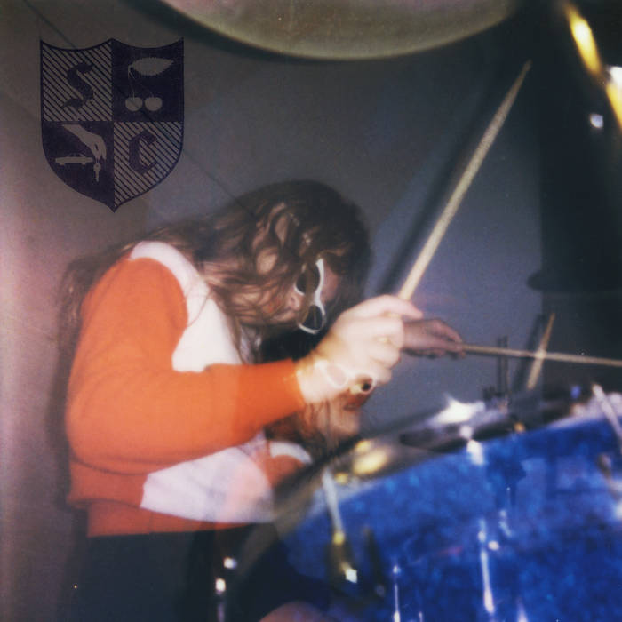

[[https://snocaps.bandcamp.com/album/snocaps][*Snocaps* by Snocaps]]

Unapologetically catchy, produced enough to not feel like a demo tape,
but not so much that it has the sometimes-cloying polish of recent
Waxahatchee (full disclosure, I have a sweet tooth).  "Angel Wings" is
the first ear-worm in a while I've enjoyed having.
