#+title: 2026 in 52 albums
#+HTML_HEAD: <link rel="stylesheet" type="text/css" href="style.css" />
#+OPTIONS: html-style:nil H:1 num:nil toc:nil
The concept's pretty simple.  One album per week, not necessarily [[https://nmmull.github.io][my]]
favorite album of the week, not necessarily a new album, just one I
listened to and liked.

This microblog is written without the use of generative AI.

-----

* Week 25 (6/14)

#+ATTR_HTML: :width 300px
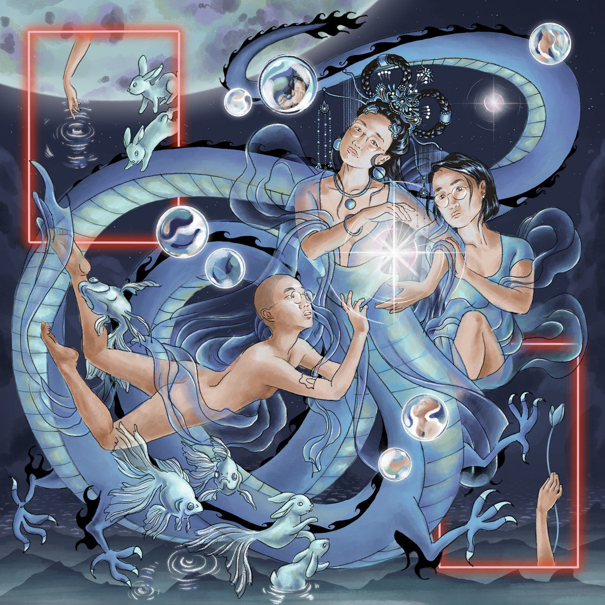

[[https://mingjia.bandcamp.com/album/star-star][*star, star* by mingjia]]

I found myself in a contemporary classical rabbit hole on bandcamp and
came across this album by the one of the teeth-contributers (dumb
joke) that somehow went under my radar.  Which surprises me at least
in part because the album art is so striking I would have expected it
to catch my eye if it ever found it's way on my computer screen.

This album has a lot of my favorite things about the classical pop
cross-section.  The classical-side may find it too musical theater.
The pop-side may find it, also too musical theater.  It's admittedly a
bit musical theater.  But that's not why I love it (nor is it a
negative in my view).  Mingjia sings like its an extension of her
speaking voice.  She enunciates.  I cannot stress how much this feels
like an aesthetic choice and not just an emergent feature of proper
training. Her voice is glass smooth and glass clear, her minute
flourishes never come at the expense of the story she's telling.  The
arrangements are what read classical, and there are some excerpts that
could be part of a proper symphony, but this in itself feels
unnecessarily boxy as a descriptor (also a tad elitist).  The story
telling also reads classical──the pieces are long and meandering──to
the extent that I might amend my previous phrase and rather say that
it's /operatic/.

-----

* Week 24 (6/7)

#+ATTR_HTML: :width 300px
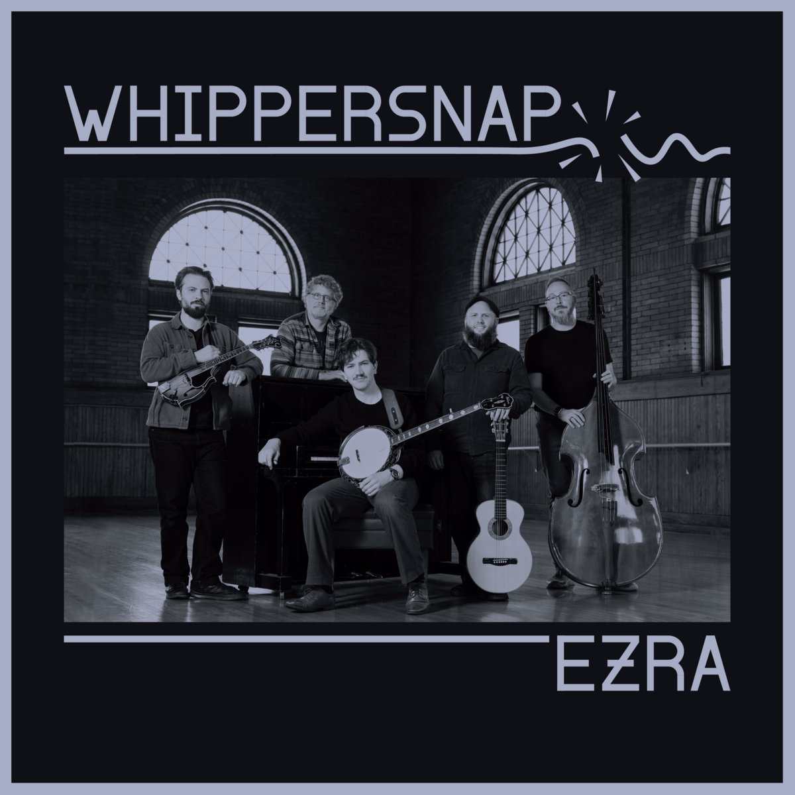

[[https://ezraquartet.bandcamp.com/album/whippersnap][*Whippersnap* by EZRA]]

A collegue of mine hosts (and produces and engineers) a radio program
on WMBR Camridge called [[https://alleystoughton.us/not-brahms-and-liszt/][/Not/ Brahms and Liszt]].  A such she has
fantastic taste in music, and every time I get a chance to chat I ask
about what music's been exciting her (the first recommendation she
ever gave me was *STILLPOINT* by Awadagin Pratt, which remains a
favorite of mine).  I brought up that I'd been listening to The Hands
Free's new album *Upturned Cup*, and she followed with *Froggy's
Demise* by EZRA.  And, honestly, checkmate.

Classically-Jazzically-inclined bluegrass isn't new, but I think it
finds it's greatest popularity──and arguably one of it's highest
inflection points──in the *The Goat Rodeo Sessions* (of course the
related prototype/offshoot projects are important too; as an aside,
I've always been curious how Béla Fleck fits into the picture, a
frequent collaborator with Edgar Meyer, but somehow not a Goat
Rodeo-er).  After a supergroup like this, it's difficult to imagine a
huge amount of movement in this already rarefied space.  EZRA reminded
me (like a slap in the face) that there many dimensions to musical
innovation.  There is of course technical skill (which EZRA clearly
has, within grasp of the Goat Rodeo crew), but there's also genre
fluidity, there's group cohesion.  The transitions between avante-jazz
and bluegrass lick are quick, and often done with a kind of precision
that feels like watching someone slalom with an Escalade (this is not
a particularly flattering metaphor, but once I thought it I couldn't
eject the image from my mind, and just it feels right).  True solos
are sparse, there are leading players on most pieces but it's well
balanced (both Pomaria and Gossamer have lovely bass melodies).  The
introduction of the piano on this album's instrumentation occasionally
leans saccharine, but mostly gives a satisfying body to the entire
project.

-----

* Week 23 (5/31)

#+ATTR_HTML: :width 300px
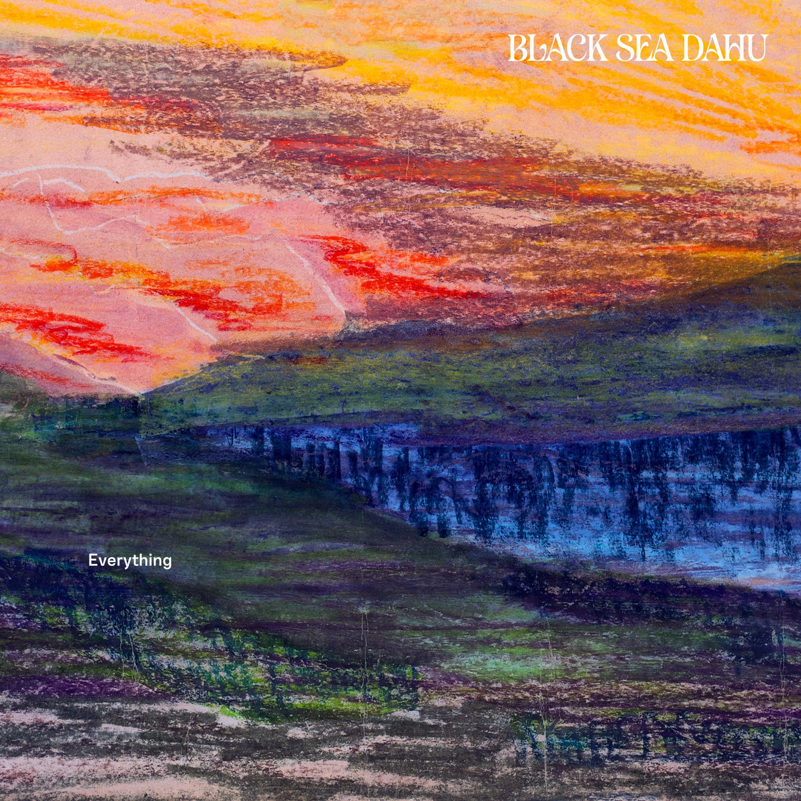

[[https://blackseadahu.bandcamp.com/album/everything][*Everything* by Black Sea Dehu]]

Okay, so I made a suggestive hint last time as to what kind of album
I'd be covering this week.  And I did give *Clifford Brown and Max
Roach at Basin Street* as well as *Freedom Suite* a fair number of
listens.  But I have to stay true to the concept of this microblog,
and the reality is this album ultimately dominated my queue (also, who
the f*** cares? I'm well aware no one's reading this).

Black Sea Dehu is another Swiss band on [[https://mouthwateringrecords.bandcamp.com][Mouthwatering Records]] (the
label is the intermediate node in my web-surfing-graph from To Athena
of Week 21).  The first important point to address: /What is a Dehu?/
Great question.  A Dehu is a mountain-goat-ish creature whose legs are
shorter on one side of its body (naturally).  From [[https://en.wikipedia.org/wiki/Dahu][Wikipedia]]: "there
are two different types of dahu: the /laevogyrous dahu/, with shorter
legs on its left side, walks around the mountain counterclockwise; the
/dextrogyre dahu/, with the shorter legs on its right side, walks
clockwise around the mountain."  Someone was having fun.

I think what makes this album so compelling is that is feels jammed
packed with everything (nudge nudge): musical and lyrical prowess,
emotional outpour, mythos, the tug of life and death, of
traditionalism and experimentalism.  It feels tight; the album blurb
notes that it comes on the heels of some major touring hours.  It also
notes that it's shrouded in grief: "Created in the aftermath of losing
a parent and the years of stumbling that followed, it grew like a
forest after fire."  The result is stunning, but in a way that
necessitates a couple listens.

Case in point: Ants on the Wall (the opener) is a lovely rumination on
the mundane: ants come in the summer.  Arrangement-wise, it's core is
a clear ambling guitar, a minimal drum beat, airy vocals.  This is
layered with rhythm guitar, bass (okay sure) but then also a steel
guitar, another electric guitar, an array of percussional clicks and
clacks, clarinets, accordion, backup vocals (and as far as I can tell,
exactly one additional "oh" from an unknown vocalist which lasts
something like 3 seconds).  It's a lot. But somehow it's not crowded.
It's the kind of arranging that I've never fully grasped, along the
lines of early Sufjan, akin to the way a painter will include a
flourish of green within a decidedly red-blue skyscape that I'd never
think to include but is somehow just right.  And all this eventually
quiets, closing with these haunting lyrics:

#+begin_quote
Is it June again?
Are you really dead?
What's the catch?
Deep within the ground
the queen's waiting for her eggs to hatch
#+end_quote

The entire album has this energy. It's devastating. It skirts the edge
of some unknown cathartic release.  I also must say that Janine
Cathrein's voice is gorgeous; she uses little vibrato, and
her ability to oscillate/transition between notes is chilling.

-----

* Week 22 (5/24)

#+ATTR_HTML: :width 300px
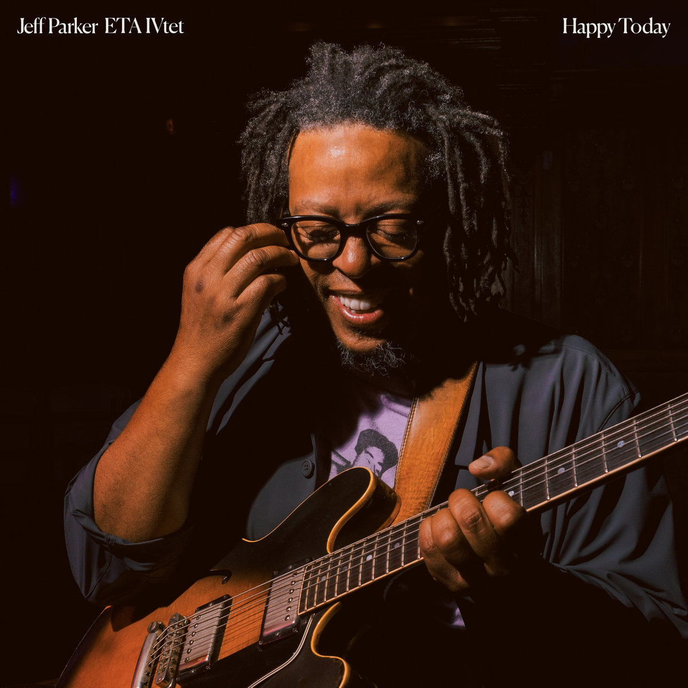

[[https://intlanthem.bandcamp.com/album/happy-today][*Happy Today* by Jeff Parker ETA IVtet]]

This weekend I went to the [[https://www.the-mushroom-shop-somerville.com][THE mushroom shop]] in Somerville with a
friend and the person behind the counter was playing this album.  I
hadn't listened to it yet, but it's not hard to clock the Jeff Parker
and friends.  I've been listening to Jeff Parker since *Suite for Max
Brown*, having been following International Anthem since Ben LaMar
Gay's *Downtown Castles Can Never Block The Sun*.  This album is in my
mind very much a continuation of *The Way Out of Easy* (the implicit
criticism being hopefully as ambiguous as intended).

Okay, here's my take, which is less cogent than usual (usual being
just barely). There's music that feels like a towel's been squeezed
into a taut rope, every ounce of energy and spirit wrung out. There's
music that brings to mind a Miyazakian draughtsman, i.e., meticulous
powerful grace (with an invisible wind that lifts one's hair from
below).  There's music whose weight comes from the lineal torch it's
chosen to bare. This album is none of these.  It's somehow alien, not
because the sonic territory the group's treading is particularly
unique, but because it's difficult to predict where it's gonna go.  We
as listeners are companions on a journey led by experts, with the
understanding that things may not go as expected. To make a hack but
apt metaphor, this is music that feels like a mushroom hunt headed by
an experienced forager.  It lends the project a vulnerability that
seems out of place in not-uncommon machismo mentality of the music
world.  As someone with a touch of musical skill (though absolutely
none in the field of jazz) the highest praise I feel I can give is
that this music makes me want to join in, it brings me back to
improvising with friends.  And of course, this is not to say that way
they do is trivial, just that it's warm, welcoming, and inspiring.

As an aside, I had a lovely time chatting with the aforementioned
person behind counter.  I did that dumb thing where I was so excited
to talk /my/ listening-queue to I forgot to ask for theirs (an
embarrassing example of the egocentricity I claim to not have).  I
ended up going back several days later to actually buy mushrooms (I
didn't first go, but got some gorgeous morels second go) and saw them
again but /still/ didn't ask them (dammit) but there were more folks,
and some introductions, and we got to talking about Sonny Rollins
passing (guess who's up next week), and my parents were there which,
despite loving them, always makes me more awkward, so it was a whole
thing. Hope I get a chance to chat with them again.

-----

* Week 21 (5/17)

#+ATTR_HTML: :width 300px
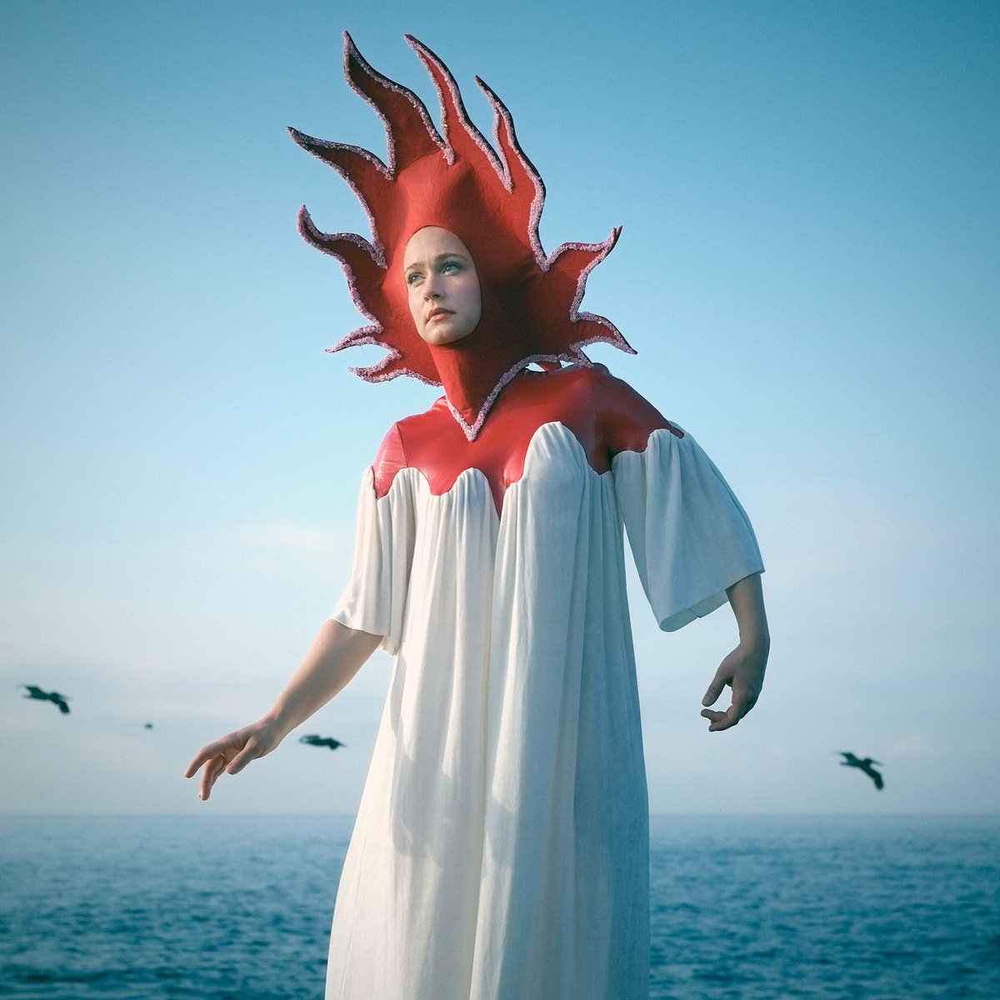

[[https://toathena.bandcamp.com/album/have-i-lost-my-magic][*Have I Lost My Magic?* by To Athena]]

It's the first week after the end of the academic year, and in
addition to hiding from the world, it seems I didn't listen to much
new music (in fairness I also didn't read much either, I think my
brain needed a hard reset).

One unfamiliar album made it onto my long-walk listening queue, and
I'll be frank, I don't love it (though I do like it, per the premise
of this microblog), but I adore the album cover.  It's weird,
vulnuerable, powerful, mythical, beautiful, with perfectly John
Singer-Sargent hands.  Actually, this album feels like an exercise in
whole enchilada theory (not really a thing, if that wasn't clear).
The title of the album for example saves the project from going
immediately in my Lily-Allen-esque bucket (a surprisingly full bucket,
but in the way that I couldn't bring an example to mind because I tend
dimiss then forget before committing to memory, a bad habit I'm well
aware).  The question reminded me going into the album to allow the
kinds of emotional states that come from thinking things like: /What
scared me about movie Pinocchio? Did I really see a ghost that night?
Remember when my cousin and I believed we could unlock super-strength
via a kind of induced fugue state?/...──allow those states to wash
over the way they used to.  Without this it's easy to get into my
usual jaded headspace; I almost turned it off at Dänke, and Weird Kid,
albeit a fun song, borrows the first-line melody of A Day in the Life,
which I can't not hear.

But, yes, I liked this album. A fair amount too.  It helps that I was
a Beatles kid (to the extent that I cannot listen to the Beatles now,
like, at all) so the nostalgic flares of late-English-cinematic-pop
really work on me (operative word be "on" and not "for").  The places
where this album shines is in it's slower more introspective songs.
They hit like lullabies, hovering in layers multi-instrumental and
electronic sound experiments.  I can imagine getting lost in the
forests of Switzerland to these songs, the sun setting, alone, my fear
of the dark creeping in, but somehow with a smile on my face.

-----

* Week 20 (5/10)

#+ATTR_HTML: :width 300px
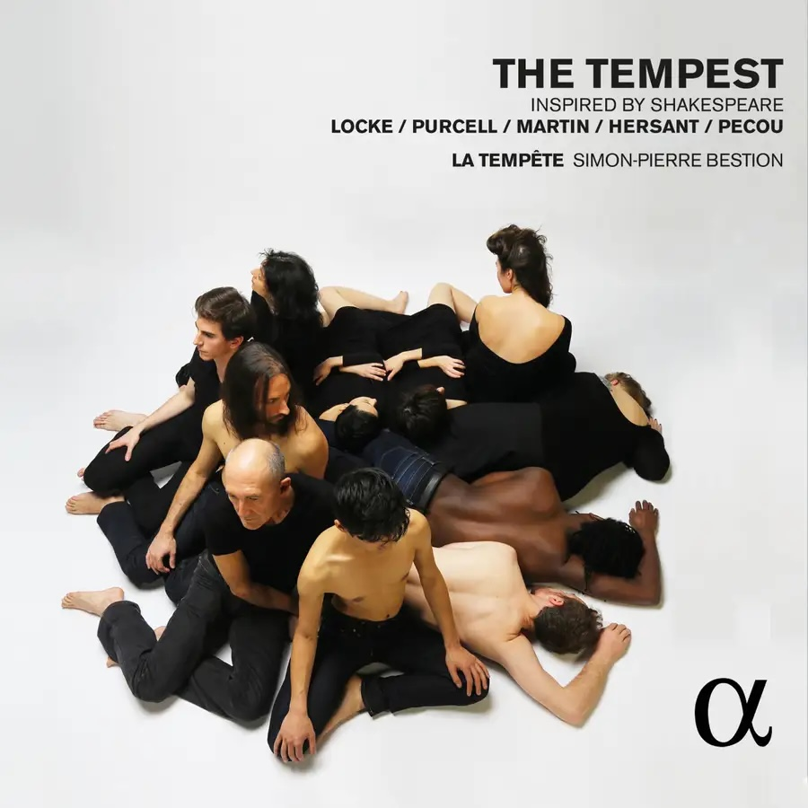

[[https://www.prestomusic.com/classical/products/8061505--the-tempest][*The Tempest* by La Tempête]]

I don't know how but Simon-Pierre Bestion has made early music,
somehow, cool?  Or is he trying too hard?  I honestly can't tell.  But
at some point you have to appreciate the hustle.

Props to [[https://giraffasaur.us][my dad]] on this one (of [[https://www.picturemecoding.com][Picture Me Coding]] "fame") he
recommended to me La Tempête's most recent album *Bomba Flameca*,
which is by far one of the most bizarre albums of early music I've
ever listened to (I'm not gonna explain it, just go listen).  Since
then I've been digging into their discography.  *The Tempest* isn't
quite as "out there" as some of what they've gotten into, but it's
still expertly curated and the performance is oozing with first-album
energy (I, as a general rule, am fascinated by debuts, that raw desire
to impress is extremely moving to me).

-----

* Week 19 (5/3)

#+ATTR_HTML: :width 300px
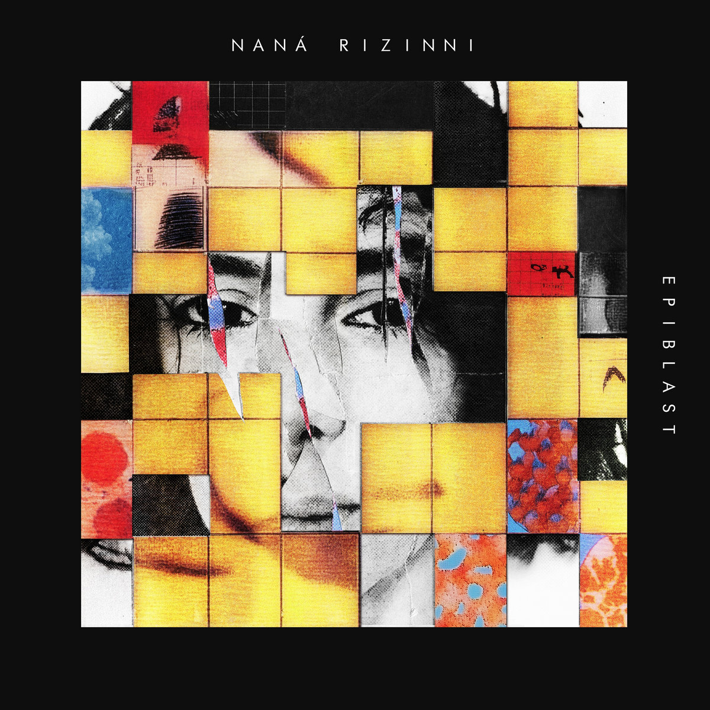

[[https://nanarizinni.bandcamp.com/album/epiblast][*Epiblast* by Naná Rizinni]]

Credit to Bandcamp on this one, it came up on my feed.  What's
strangest to me about this album is that it feels straight out of the
early 2010s, down to the album art.  It has a familiar dinginess about
it (Is that just me? Are the 2010s dingy? They feel dingy to me) a
familiar desire to incorporate electro, beat tape, and hip-hop motifs
into /everything/ (there are times it felt like a race to the bottom,
/which folk band would discover the synthesizer/drum pad next?/).  I
can imagine it sitting comfortably on my shelf between Son Lux's *We
are Rising* and Robert Glasper's *Black Radio* (which is a pretty apt
characterization of my music-taste genesis).

As familiar as I've made it out to be thus far, there are a couple
surprises: "The Right Side of the Elevator" breaks me out of any
reminiscing I'm doing and brings me to a truly fantastic place. Also
there's a hilarious interjection in the opening piece which, despite
being low-hanging comedic fruit, gets me every time.

-----

* Week 18 (4/26)

#+ATTR_HTML: :width 300px

[[https://diners.bandcamp.com/album/domino][*DOMINO* by Diners]]

I feel like I should've heard of Diners by now.  That said, when I
mentioned this album expecting the "yeah, I've been listening to them
for years" response, most folks hadn't heard of them.  It's got
flavors of textbook power pop, but has a pretty unique compositional
streak, the kind I have a hard time explaining because music
composition has always been beyond me.  It feels through-and-through
California, which I'm reaching for more these days out in the wilds of
Cambridge MA (why can't I convice my east coast friends how weird the
east coast is?).  The track "Someday I'll Go Surfing" makes me tear up
in that homesick/dreams of high school way.

It's impossible to not bring up that I came across this album because
a friend of mine from another life recently collaborated with Blue
Broderick under the name Judy on an EP called *Songs of Mutt and
Hate*, also very much worth a listen.

-----

* Week 17 (4/19)

#+ATTR_HTML: :width 300px
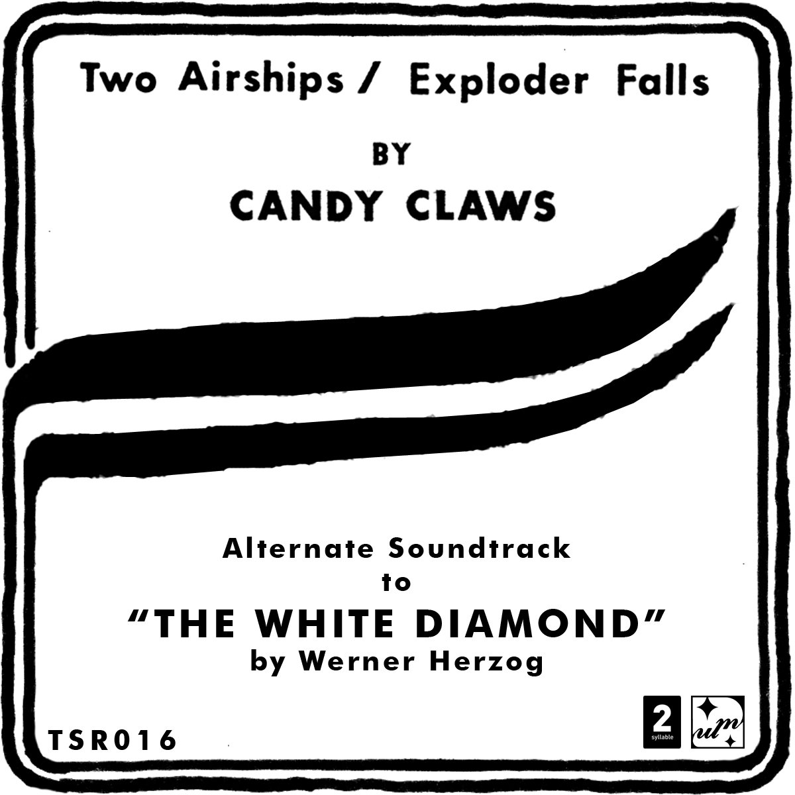

[[https://candyclaws.bandcamp.com/album/two-airships-exploder-falls-2][*Two Airships / Exploder Falls* by Candy Claws]]

I missed the whole Candy Claws thing (I feel like I remember Ceres &
Calypso in the Deep Time being on Pitchfork back when I still followed
Pitchfork, can't say for certain), but I was listening to wmbr (the
MIT campus radio station) and a someone (probably a decade younger
than me) played Exploder Falls.  It's got what I perceive to be an
anachronistic amount of bitcrusher.

-----

* Week 16 (4/12)

#+ATTR_HTML: :width 300px
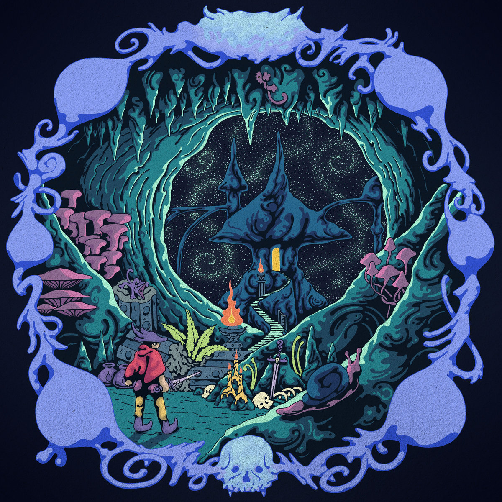

[[https://meiehara.bandcamp.com/album/all-about-mcguffin][*All About McGuffin* by mei ehara]]

I wish I could say I discovered this album because I'm keyed into the
amorphous world of capital-M-Music, but the truth is that Mei Semones
came out with an EP recently (also worth a listen) so I typed their
name into the search bar of the Bandcamp app on my phone and because
touch screens are awful I got to the page of this album and I thought
okay what the heck the cover's kind of cool.

And yeah, wow, it was so worth it. This is one of my favorite albums
of the year so far.  It taps into the chill post-pysch-rock sound à la
Crumb while keeping a foot in the no-wave door, but sort of just
barely. Like they're winking at you, but only when you're not looking.
Often it's just an off-kilter dissonance in the bassline or guitarline
or vocalline, but it tips the scales towards an uncanny valley between
easy listening and ironic posturing.

Except, then there's the quite guitar-vocal track /I miss you/ that's
so touching it makes me wanna cry.  So I dunno, it's kind of all over
the place.

-----

* Week 15 (4/5)

#+ATTR_HTML: :width 300px
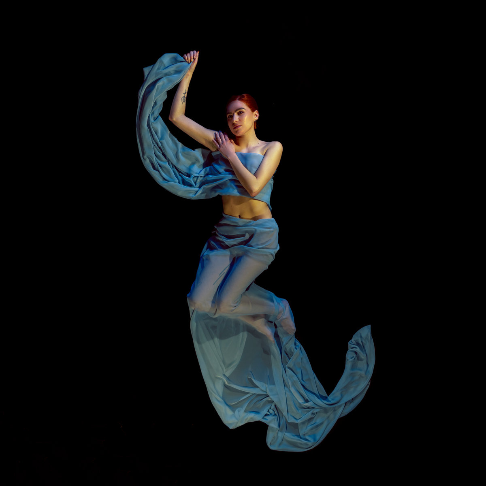

[[https://thisiscarlile.bandcamp.com/album/human-human][*Human Human* by Carlile]]

I came across this album during my most recent browsing of the Sooper
Records (Sen Morimoto, Luke Titus, NNAMDÏ, KAINA) catalog.  It's a
hidden-gem-of-a-collection of pop-leaning songs that I could
unironically recommend to a top-20s-listener (i.e., not in the
backhanded try-harder-to-have-good-tastes way).  It has that
nostalgic-80s-cross-Britney-Spears influence that's trendy, but
manages to stand out, even if only in its attention to detail (I love
the use of silence in For Emi and Neosporin).  One could be forgiven
(though not by me) for dismissing this one as "just another pop album"
but there's something satisfying in seeing mastery in the commonplace;
if I may be pardoned for a lazy analogy: there are, in fact, excellent
plain scones.

-----

* Week 14 (3/29)

#+ATTR_HTML: :width 300px
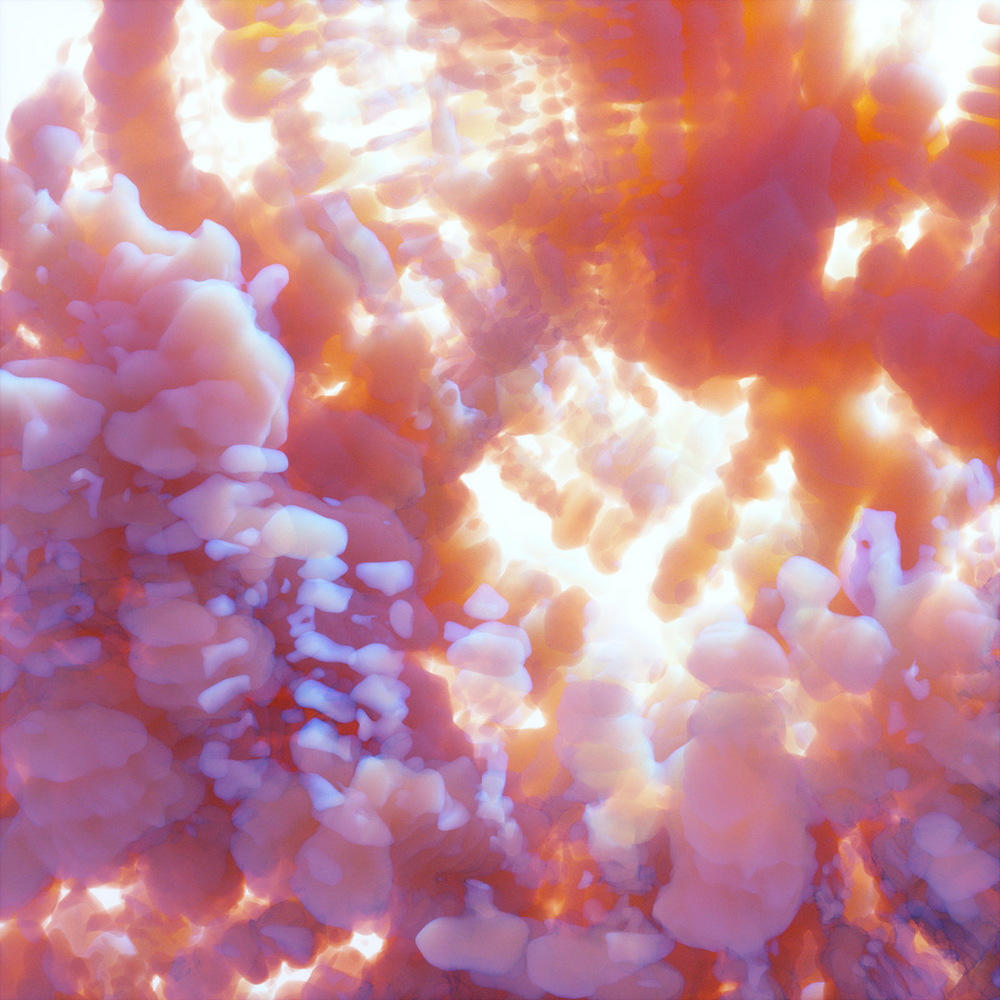

[[https://lynyn.bandcamp.com/album/ixona][*Ixona* by lynyn]]

I've never been big on house/EDM/IDM/whatever electronic music, but
like ambient, every once in a while there's something that holds my
interest. lynyn has the academic/experimental flavor of early early
James Blake─and that may be my only concrete point of reference so
this is all to say it's similar the the only other
house/EDM/IDM/whatever I've historically liked.

-----

* Week 13 (3/22)

#+ATTR_HTML: :width 300px
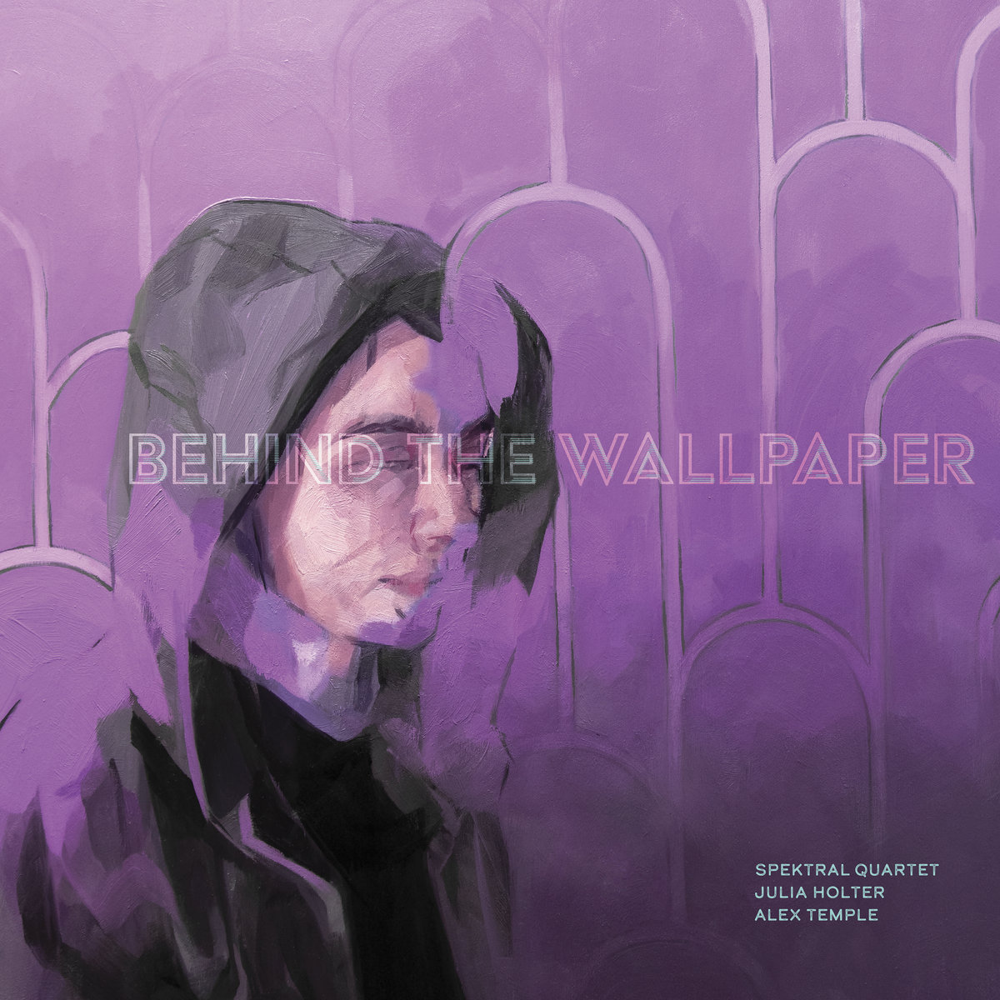

[[https://newamsterdamrecords.bandcamp.com/album/behind-the-wallpaper][*Behind the Wallpaper* by the Spektral Quartet, Julia Holter, and Alex Temple]]

Writing about Julia Holter scares me slightly.  Obviously I'm granted
a certain distance with this album because Julia Holter is not the
composer proper, but it's clear that Alex Temple took notes; Julia
Holter fits comfortably in the space carved out by this piece.  I'd
like to say I'm scared to write about Julia Holter because of the
weight of doing justice to her intention and vision.  Truth is I'm
scared to write about Julia Holter because it requires me to confront
the uncomfortable fact that I have only the most passing knowledge of
music theory, despite having played music for most of my life (I'm the
kind of person who internally scoffs when someone tells me their child
is an impressive musician, and then hates himself for it). It seems
clear to me that Julia Holter, when she composes and performs music,
is "doing something." I get the sense she has a deep knowledge of
musical structure and form, leaving her intention simply inaccessible
to me; tldr it makes me feel dumb and I'm not a fan of feeling dumb (I
glean all this in the same way that I glean a physicist knows physics,
which is to say I don't know physics well enough to actually judge
their physics-wise acumen, but I generally get the gist being a
supposed expert in a sufficiently adjacent field).  But, as they say,
f*** it.

Alex Temple and Julia Holter work in what I believe is a new dimension
of poetry. The melodic dimension of their lyrics feels distinct from
song, the phrasing hints at a kind of internal consistency; I can
imagine most Julia Holter songs─and every movement of this piece─as
stand alone objects; the tonal decisions seem to aim at complementing
the language more than the music.  Said another way, I feel the
melodic dimension is akin to the typographical dimension of concrete
poetry, and this dimension─an extension of the lyrics─creates space,
what's ultimately a space of play in which the quartet can wander.
The underlying accompaniment is light, responsive, full of flourishes,
some cinematic, some highly textured, but with a self-consciousness of
it's space-filling duty.  This gets dangerously close to becoming
gloopy, but manages to stave off this criticism (at least from me).

One more thing I cannot help but point out: I've seen several
comparisons of this piece to Schönberg's String Quartet No. 2 which,
besides feeling like an avant-gardian name-drop/flex, I think is far
less applicable then a much more obvious comparison: *The Juliet
Letters* by Elvis Costello and the Brodsky Quartet.  The similarities
are eerie, to the point that I feel like I'm being gaslit when I
cannot find anyone else making this connection.

-----

* Week 12 (3/15)

#+ATTR_HTML: :width 300px
[[file:covers/extra-stars.jpg]]

[[https://intlanthem.bandcamp.com/album/extra-stars][*Extra Stars* by Gregory Uhlmann]]

Gregory Uhlmann at it again, in a strange but not unprecedented way.
Something like an academic study of blips, bloops, taps, tinkles,
thumps, and drones.  What more could you want (or say, for that matter)?

-----

* Week 11 (3/8)

#+ATTR_HTML: :width 300px
[[file:covers/farming.jpg]]

[[https://deathbombarc.bandcamp.com/album/farming][*Farming* by Ted Hearne & The Crossing]]

At the risk of offending a group of folks I do not wish to offend (and
with the hope of offending a different group just the right amount) I
submit the following claim: nunchucks are the dorkiest martial arts
weapon (I'm choosing to use the Americanism "nunchucks" instead of the
more correct "nunchaku" because I've never in my life actually heard
the word "nunchaku" said aloud).  This isn't inherent in the form or
origin of the implement, rather the product of a near-concerted effort
by a species of dorky white male American sinophile.  In order to lend
myself an iota of authority on the matter (of which, in reality, I
have none) I'll mention briefly that I practiced Kung Fu as a "yute",
and although I was partial to the humble broadsword (which I have to
thank for a souvenir in the form of a 1in scar on my ankle,
self-inflicted (accidently) by one such sword of the blunt practice
variety) I was also fascinated in that same (teenage-)dorky-sinophile
way to the more "exotic" weapons, e.g., the double hook swords of
Jet-from-Avatar fame, the double hammers (which also make an
appearance in ALTA with a lesser bad-guy side character), the chain
whip (whatever you're imagining is probably pretty close), and a
personal favorite, worthy of a Google: the horse bench.  And although
I've already spent too much time on this supposedly brief aside, I
can't help but recall a memory of watching a performance of a dual
weapon form (think choreographed knife fight) between chain-whip and
double hook swords, which felt like the moral equivalent of throwing
firecrackers at someone with a weed-whacker.

Self-consciously (bad) Wallacian digression notwithstanding, I further
submit a thought experiment: imagine watching a performance of said
dorky white male American sinophile /using/ said nunchucks.
Furthermore, this is someone who has taken up the practice of martial
arts not simply as a kind of socially-recognized affectation, but who
has /actually/ studied the art /as an art/ and is /actually/ pretty
good.  Imagine him manipulating those chained wooden sticks with
Bruce-Lee-level grace, but still moving in that somewhat awkwardly
stiff way that people who haven't done gymnastics/dance/acrobatics
their whole lives naturally do.  If the image in your mind is at all
similar to mine, you might get the sense of the cringy beauty I'm
trying to convey (in my now-very-self-consciously circuitous way).

The thesis: /Ted Hearne & The Crossing wield irony like our friend
from the though-experiment wields nunchucks./ I can't say that
*Farming* is a "good" album, but it has that aforementioned cringy
beauty; I can't stop listening even though it makes me tired and a
little angry.  Sound-wise, it brings to mind Roomful of Teeth's *Rough
Magic*, in which the group seemed to want more "edge", except that
*Farming* takes this concept to it's Weierstrassian extreme, to a
veritable lump of nothing-but-edge (where, if you tried to pick it up,
you'd be infinitely pin-pricked by its fractalous surface).  I imagine
an AI agent fed on a steady diet of Reich's speech-melodies,
Americana, Fox News, hyperpop, and church-on-TV could hallucinate a solid
approximation of this album, but there's something so /human/ and so
utterly /committed/ in the combination of heavy-handed social
commentary and high production value and the literal human-factor that
The Crossing brings.  There's a feeling of fighting fire with
howitzers, a recognition of futility alongside a real sense that they
are trying to say /something/.  And sometimes they seemingly do, other
times they emphatically do not.  Regardless, it leaves the mind
reeling, /is this what it takes to get me out of my
individualist-consumerist stupor and actually do something?/ Probably
not, but I did ask myself the question.

-----

* Week 10 (3/1)

#+ATTR_HTML: :width 300px
[[file:covers/escenarios.jpg]]

[[https://javierburin.bandcamp.com/album/escenarios][*Escenarios* by Javier Burin]]

I've been on the fence about this one for a while now.  I thought I'd
make it this week's album so I could figure out if I actually like
it. Final analysis: I do.  This one made me work for it; at first it
just barely registered under the din of the currently-crowded
post-bebop/modern chamber jazz soundscape.  I think what ultimately
did it for me was the solo in the second track "PF" which plays like a
slightly unhinged Bach.  It also took me several listens to realize
just how full-bodied the tracks are.  The first couple listen-throughs
I guess I thought some tracks were multiple; several of them are past
the 7m mark and often the thread, though strong, weaves haphazardously
through a number of different stylistic groundings (no apologies for
mixing metaphors).  One gets the feeling when listening to these folks
(if my experience is not wholly solipsistic) of being in the presence
of some wicked talent (I'm a Bostonian now), talent that is achingly
vying for attention.  This doesn't mean it's contentious──sometimes
the easiest way to get someone's attention is with the help of some
other attention-getters──but it lacks that cool
I'm-so-good-I-could-give-my-buddy-the-spotlight-and-you-still-couldn't-help-noticing-me
character of some of my absolute favorite jazz albums (people who've
known me long enough and have talked music with me will know that my
such-as example is Ben Wendel's *Understory: Live at the Village
Vanguard*).  One consequence: the album is sprinkled with "gimmicks"
several of which are used by the greats but are gimmicks none the
less: (1) the bass-follow-piano riffs that give a satisfying almost
hip-hop cadence (2) the hidden-rhythm syncopation of one voice
followed by the another which sets the beat (like Vijay Iyer's
"Accelerando" or Dirty Projectors' "The Socialites").  But in my view
the real kicker is that Javier Burin is freakin' 25 (22 on recording
this album), and I'm very much looking forward to whatever's next.

-----

* Week 9 (2/22)

#+ATTR_HTML: :width 300px
[[file:covers/ava-luna.jpg]]

[[https://avaluna.bandcamp.com/album/ava-luna][*Ava Luna* by Ava Luna]]

Ava Luna is era-defining for me (which essentially means I listened to
them in college).  *Electric Balloon* felt like a revelation (though I
would later learn it was basically a revival of no-wave in the style
of James Chance and the Contortions).  I remember being floored by
"Billz", the first single off *Infinite House*, with its oscillations
between crushing wall of noise and chill groove; urgent and virtuosic,
driven by the truly important questions: "who's gonna pay my bills?"
(also, gotta say, "Steve Polyester" is one of the best non-Pynchon
Pynchon characters out there).  I was lukewarm on *Moon 2*, I enjoyed
it primarily in a second-order way, but it felt like it wasn't meant
for me (maybe for someone with stronger ties to Devo and Talking
Heads). I was bummed to hear in 2019 that we weren't gonna get any
more Ava Luna, but Carlos Hernandez and Felicia Douglass continued to
make music so it didn't feel /over/ over (*On Folly* seemed very much
a continuation of the Ava Luna storyline).  Last week, getting a
sudden urge to listen back to *Moon 2* (maybe this time I'd "get it")
I learned that Ava Luna came out with an album last year (!). On first
listen I was, disappointed.  It has none of the pent-up energy, the
deep-cutting angst, less I-need-to-say-this-let-me-speak and more
getting-older-and-throwing-up-the-hands.  The album is a distillation
of everything that makes Ava Luna unequaled composers and musicians,
but I see parallels with the last Dirty Projectors project *Songs of
the Earth*, in which composition becomes the sole vehicle for
expression.  Despite this, I listened through again, and then again,
and again, and then it clicked: it's a damn fun album.  That I think
is the thread through everything they do.  They're a group of super
talented folks, getting together yet again to make music, building on
their years-worth of experiences, and the product is, simply put,
beautiful.  The banter at the end of "My Walk" makes me smile every
time I listen to it.

-----

* Week 8 (2/15)

#+ATTR_HTML: :width 300px
[[file:covers/pink-hell.jpg]]

[[https://honeymoan.bandcamp.com/album/pink-hell-deluxe][*Pink Hell* by Honeymoan]]

Sometimes I feel like I'm getting too old for ironic
depresso-mean-girl synth-pop-punk bullshit (also thinking of Dev
Lemons here) but, yeah, catharsis to the max, cathart all the way home
to this turned up loud in my little impreza.

-----

* Week 7 (2/8)

#+ATTR_HTML: :width 300px
[[file:covers/britten-korngold.jpeg]]

[[https://www.prestomusic.com/classical/products/8080670--britten-korngold-violin-concertos][*Britten & Korngold: Violin Concertos* by Vilde Frang, with the
Frankfurt Radio Symphony Orchestra, conducted by James Gaffigan]]

This week I watched the BU Symphony Orchestra's first concert of the
year, whose program included a performance by Juan Shin──the CFA 2025
concerto competition winner──of the Korngold Violin Concerto.  And,
though hyperbolic, maybe with a touch of romanticism that parrots the
piece itself, I'd say this felt like a once in a lifetime experience.
Juan's playing was technically exquisite, graceful and easy, yet
charged.  The performance felt like a gift, especially with the
intimacy of the setting: a small audience in a university auditorium
on a Friday night (and, jeez, what a stunning dress). It was the kind
of performances that makes me want to "pay it forward", to make sure I
too am giving in any way I can.  I chose this album simply as a token
(also the Britten is an all time favorite of mine).

-----

* Week 6 (2/1)

#+ATTR_HTML: :width 300px
[[file:covers/proto.jpg]]

[[https://hollyherndon.bandcamp.com/album/proto][*PROTO* by Holly Herndon]]

With all that's going on in the AI-sphere, this 2019 AI-music
experiment feels almost quiant. It's a marked departure from Herndon's
previous albums; when listening to *Movement*, one has the feeling
that every synth began life as a sine wave and was molded to fit its
aural purpose, wrestled into submission and imbued with a sense of the
primordial.  In *PROTO*, Herndon takes the voice as the starting
point, and uses AI to aid the molding, a more powerful tool for a less
giving medium.  This is done to great effect, but I believe falls into
the trap of many early-AI projects: AI is used in the way that reverb
is used in recording, it creates "aura" but muddles personality
(compare Casals and Ma on the cello suites).  The AI of it all pushes
Herndon towards "the middle", welcoming more than usual (not
unflattering) comparisons──I get flavors of Oneohtrix Point Never,
Caroline Shaw, Julia Holter, Purity Ring, and it's hard not to think
of Imogen Heap, at least for folks listening to music in the aughts.
Taken as an experiment (as I think it's intended) *PROTO* is
ground-breaking, and I can't think of anyone I'd rather address the
AI-music problem.

-----

* Week 5 (1/25)

#+ATTR_HTML: :width 300px
[[file:covers/magnetism.jpg]]

[[https://kalimalone.bandcamp.com/album/magnetism][*Magnetism* by the Kali Malone + Drew McDowall]]

Ambient can sometimes be inscrutable (at least for me) but
occasionally you get lucky with the context in which you first hear a
piece of ambient.  I was in a weird place in my life, staring out at a
pond on a cool fall day while my car was getting serviced.  The
emergent overtones and relentlessly compressed bass drones of the
synthesizer just worked for this scene and headspace.

-----

* Week 4 (1/18)

#+ATTR_HTML: :width 300px
[[file:covers/on-a-friday-evening.jpeg]]

[[https://www.prestomusic.com/jazz/products/8907369--on-a-friday-evening][*On A Friday Evening* by the Bill Evans Trio]]

Every so often, I need to listen to Evans.  And after week one of
the spring semester, I needed something with quiet strength.  Evans
for me straddles the Burkian beauty-sublime divide, the decisions
he makes with regard to phrasing seem written in the clouds.  I
also kinda love Eddie Gomez's buzzy bass in this recording, it
brings out the lightness and occasional humor of it all.

-----

* Week 3 (1/11)

#+ATTR_HTML: :width 300px
[[file:covers/trio.jpg]]

[[https://dabinryu.bandcamp.com/album/trio][*Trio!* by Dabin Ryu]]

Dabin Ryu has classical-pianist-energy.  The opener "Vertigo" has
Ólafsson precision (sub Bach for post-bop) and the intro of "In the
Land of Oo-Bla-Dee" plays like a Prokofiev piano sonata.  Also goes
without saying, Joe Martin (bass) and Johnathan Blake (drums) hold
their own, and have plenty of their own shining moments.

-----

* Week 2 (1/4)

#+ATTR_HTML: :width 300px
[[file:covers/with-greg.jpg]]

[[https://serengeti.bandcamp.com/album/with-greg-from-deerhoof][*With Greg from Deerhoof* by Serengeti]]

An unexpected but natural collaboration, the 17 minute ad-hoc live
session "I Got Your Password" is unreal.  This album has been on my
listening queue for years, but I think aptly captures 2026's
off-the-bat absurdities.

-----

* Week 1 (1/1)

#+ATTR_HTML: :width 300px
[[file:covers/snocaps.jpg]]

[[https://snocaps.bandcamp.com/album/snocaps][*Snocaps* by Snocaps]]

Unapologetically catchy, produced enough to not feel like a demo tape,
but not so much that it has the sometimes-cloying polish of recent
Waxahatchee (full disclosure, I have a sweet tooth).  "Angel Wings" is
the first ear-worm in a while I've enjoyed having.
